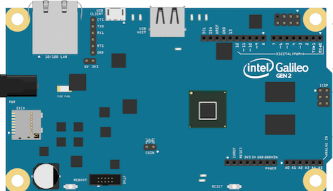

# Intel Galileo Gen 2
[](https://travis-ci.org/nerves-project/nerves_system_galileo)

This is the base Nerves System configuration for the Intel Galileo Gen 2.


<br><sup>[Image credit](#fritzing)</sup>

| Feature              | Description                     |
| -------------------- | ------------------------------- |
| CPU                  | 400 MHz Intel Quark X1000       |
| Memory               | 256 MB DRAM                     |
| Storage              | 8 MB NOR Flash and MicroSD      |
| Linux kernel         | 3.8 w/ Intel patches     |
| IEx terminal         | UART via ttyS1                  |
| GPIO, I2C, SPI       | Yes - Elixir ALE                |
| ADC                  | Yes                             |
| PWM                  | Yes, but no Elixir support      |
| UART                 | 1 available - ttyACM0           |
| Ethernet             | Yes                             |
| WiFi                 | Requires USB WiFi dongle        |
| Bluetooth            | Not supported                   |

** This platform has worked in the past, but has a number of issues. **

If you're interested in x86 platforms, take a look at a generic x86 system
like that in [ag150](https://github.com/nerves-project/nerves_system_ag150).
Otherwise, ARM boards such as the Raspberry Pi and BeagleBone Black are
faster, less expensive, have more modern Linux kernels, and have better
upstream support. If you're still interested in
the Galileo Gen 2, please contact us and consider maintaining this platform.
It does have a couple interesting features, but the overhead of supporting
it is high compared to the number of known users.

## Notes

After the board boots, you must load several kernel modules to use the peripherals:

```
:os.cmd('modprobe intel_qrk_gip')
:os.cmd('modprobe gpio-pca953x')
:os.cmd('modprobe pca9685')
:os.cmd('modprobe adc1x8s102')
```

If you have an Intel Galileo Gen 1, it may work but is untested. Try loading the following:

```
:os.cmd('modprobe intel_qrk_gip')
:os.cmd('modprobe cy8c9540a')
:os.cmd('modprobe ad7298')
```

## Processor bug

The X1000 has a bug on the lock prefix requiring that prefix must be stripped at build time.
It is important that the following parameter is passed to `gcc` to do this:

    -Wa,-momit-lock-prefix=yes

Buildroot does this automatically, but Nerves doesn't pass the parameter around yet.


## Limitations

  1. Boot time is long - this is mostly due to the NOR Flash bootloader waiting
     on input.
  2. Ethernet MAC is not set. Wired Ethernet doesn't work and the node name is
     always `nerves-0000`.

## Supported USB WiFi devices

The base image includes drivers and firmware for Ralink RT53xx
(`rt2800usb` driver) and RealTek RTL8712U (`r8712u` driver) devices.

We are still working out which subset of all possible WiFi dongles to
support in our images. At some point, we may have the option to support
all dongles and selectively install modules at packaging time, but until
then, these drivers and their associated firmware blobs add significantly
to Nerves release images.

If you are unsure what driver your WiFi dongle requires, run Raspbian and configure WiFi
for your device. At a shell prompt, run `lsmod` to see which drivers are loaded.
Running `dmesg` may also give a clue. When using `dmesg`, reinsert the USB
dongle to generate new log messages if you don't see them.

## Installation

If [available in Hex](https://hex.pm/docs/publish), the package can be installed as:

  1. Add nerves_system_galileo to your list of dependencies in `mix.exs`:

        def deps do
          [{:nerves_system_galileo, "~> 0.4.0"}]
        end

  2. Ensure nerves_system_galileo is started before your application:

        def application do
          [applications: [:nerves_system_galileo]]
        end

[Image credit](#fritzing): This image is from the [Fritzing](http://fritzing.org/home/) parts library.
